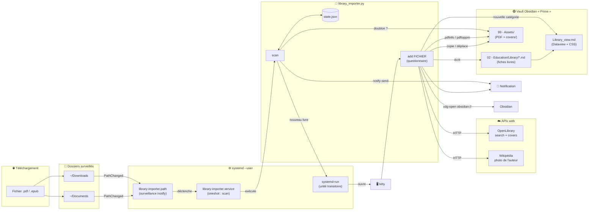
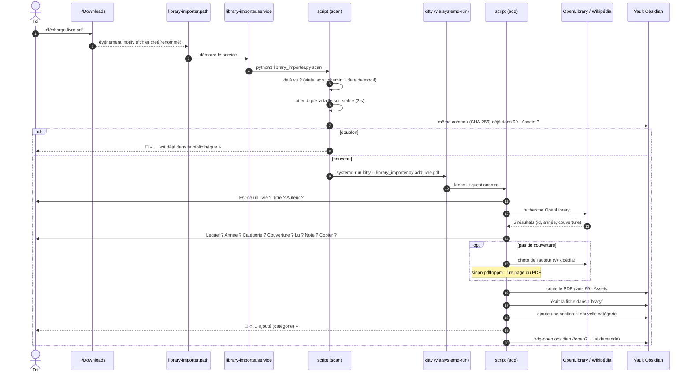
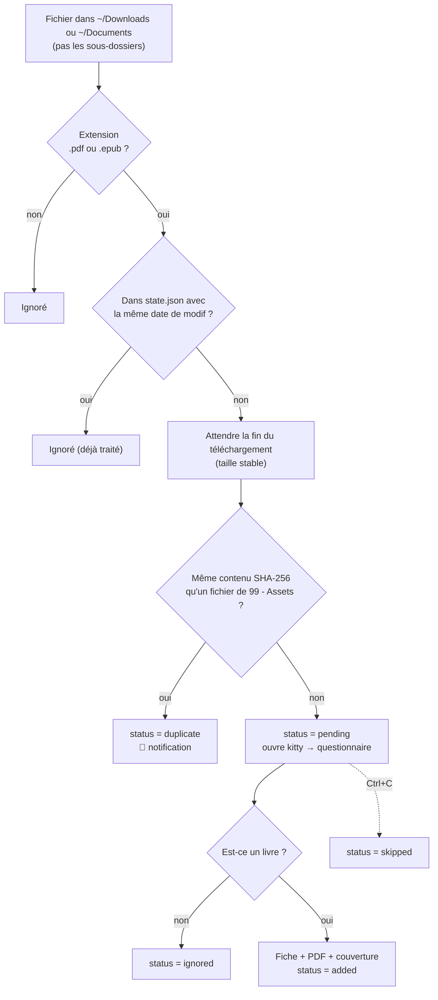
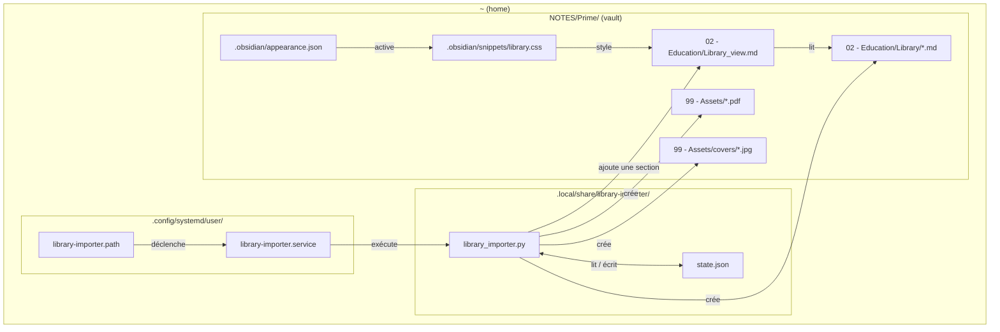

---
tags:
  - documentation
  - obsidian
  - systemd
  - bibliotheque
updated: 2026-10-08
---
# 📚 Bibliothèque : service d'import automatique

> [!info] En une phrase
> Quand un PDF ou un EPUB arrive dans `~/Downloads` ou `~/Documents`, systemd lance un script Python qui ouvre un terminal **kitty**. Le script te pose quelques questions, puis crée la fiche du livre dans Obsidian (avec couverture) et copie le fichier dans le vault. La note [[Library_view]] affiche ensuite tous les livres en galerie, rangés par catégorie.

> [!important] Tenir ce document à jour
> Toute modification du service (script, unités systemd, vue, CSS, dossiers surveillés) doit être reportée ici, y compris dans les diagrammes et dans le **Journal des modifications** en bas de page.

---

## 1. Vue d'ensemble



---

## 2. Déroulement d'un téléchargement



---

## 3. Arbre de décision du `scan`



---

## 4. Composants : applications et programmes utilisés

### 4.1 Système (Pop!_OS 24.04, session GNOME)

| Composant | Paquet / emplacement | Rôle dans le service |
|---|---|---|
| **systemd (mode utilisateur)** | `systemd` | Surveille les dossiers (`.path`) et lance le script (`.service`). Démarre avec la session, sans droits root. |
| **systemd-run** | `systemd` | Lance kitty dans sa propre unité transitoire. Sans lui, systemd tuerait le terminal à la fin du service `oneshot`. |
| **kitty** | `~/.local/bin/kitty` | Terminal dans lequel s'affiche le questionnaire. |
| **Python 3.12** | `/usr/bin/python3` | Exécute le script. Uniquement la bibliothèque standard (`json`, `hashlib`, `urllib`, `fcntl`, `shutil`, `subprocess`, `pathlib`, `re`), rien à installer. |
| **pdfinfo** | `poppler-utils` | Lit le titre, l'auteur et le nombre de pages d'un PDF. |
| **pdftoppm** | `poppler-utils` | Transforme la 1re page du PDF en image JPEG (couverture de secours). |
| **notify-send** | `libnotify-bin` (0.8.3) | Notifications de bureau (« ajouté », « déjà dans ta bibliothèque »). |
| **xdg-open** | `xdg-utils` | Ouvre la fiche dans Obsidian via l'URI `obsidian://open?vault=Prime&file=…`. |

### 4.2 Services web

| Service | URL appelée | Rôle |
|---|---|---|
| **OpenLibrary Search** | `https://openlibrary.org/search.json?q=…` | Retrouve le livre : id de l'œuvre, année, auteurs, id de couverture. |
| **OpenLibrary Covers** | `https://covers.openlibrary.org/b/id/<id>-L.jpg` | Image de couverture (lien direct, rien n'est téléchargé). |
| **Wikipédia REST** | `https://{fr,en}.wikipedia.org/api/rest_v1/page/summary/<Auteur>` | Photo de l'auteur quand il n'y a pas de couverture. |

> [!note] Gratuit et sans clé
> Ces trois APIs sont gratuites et ne demandent ni compte ni clé. Le script s'identifie avec l'en-tête `User-Agent: library-importer/1.0`.

### 4.3 Obsidian

| Composant | Rôle |
|---|---|
| **Vault « Prime »** (`~/NOTES/Prime`) | Contient les fiches, les PDF et la vue. |
| **Plugin Dataview** | Construit les tableaux de [[Library_view]] à partir des propriétés des fiches. |
| **Plugin Media DB** | A défini le format des fiches (`type: book`, `dataSource: OpenLibraryAPI`…). Le script reproduit ce format. Le plugin peut toujours servir à ajouter un livre à la main. |
| **Snippet CSS `library`** | Transforme les tableaux Dataview en galerie de cartes, en pleine largeur. |
| **Thème ITS** | Thème actif. Le snippet force certains styles (`!important`) pour passer par-dessus. |

---

## 5. Fichiers



| Fichier | Contenu |
|---|---|
| `~/.config/systemd/user/library-importer.path` | `PathChanged=%h/Downloads` et `PathChanged=%h/Documents`, activé par `default.target`. |
| `~/.config/systemd/user/library-importer.service` | `Type=oneshot`, lance `python3 …/library_importer.py scan`. |
| `~/.local/share/library-importer/library_importer.py` | Le script (modes `scan`, `add`, `init`). |
| `~/.local/share/library-importer/state.json` | Mémoire des fichiers déjà traités. |
| `02 - Education/Library/<Titre> (<année>).md` | Une fiche par livre. |
| `02 - Education/Library_view.md` | La galerie : une section et un tableau Dataview par catégorie. |
| `99 - Assets/<Titre>.pdf` | Copie du livre. |
| `99 - Assets/covers/<slug>.jpg` | Couvertures extraites de la 1re page d'un PDF. |
| `.obsidian/snippets/library.css` | Style galerie, appliqué uniquement aux notes avec `cssclasses: library`. |

---

## 6. Détails de fonctionnement

### 6.1 `state.json` : ce que le script retient

```json
"~/Downloads/livre.pdf": { "status": "added", "mtime": 1791455757.31 }
```

| Statut | Signification |
|---|---|
| `existing` | Déjà présent lors de l'installation (`init`), jamais proposé. |
| `pending` | Fenêtre ouverte, ou fermée sans répondre. |
| `added` | Ajouté à la bibliothèque. |
| `ignored` | Tu as répondu « non, ce n'est pas un livre ». |
| `skipped` | Annulé avec Ctrl+C. |
| `duplicate` | Contenu identique à un livre déjà présent. |

Un fichier est considéré comme **déjà vu** seulement si son chemin **et** sa date de modification (`mtime`) correspondent. Un fichier supprimé puis retéléchargé sous le même nom a une nouvelle date : il est donc reproposé.

### 6.2 Détection des doublons
- On compare l'empreinte **SHA-256** du fichier avec celle des `.pdf`/`.epub` de `99 - Assets`.
- Seuls les fichiers **de même taille** sont hachés, ce qui rend la vérification quasi instantanée.
- La détection ne marche que si les fichiers sont identiques à l'octet près : une autre édition ou un autre scan n'est pas reconnu.

### 6.3 Choix de la couverture (dans l'ordre)
1. La couverture OpenLibrary, si le résultat choisi en a une (🖼 dans la liste).
2. Sinon, au choix :
   - **la photo de l'auteur** depuis Wikipédia (fr puis en). C'est la règle : pas de couverture → photo de l'auteur ;
   - **la 1re page du PDF** (`pdftoppm -r 60`), utilisée aussi si Wikipédia ne trouve rien ;
   - aucune image.

### 6.4 Format d'une fiche

```yaml
---
type: book
title: "Ultralearning"
englishTitle: "Ultralearning"
year: 2019
dataSource: OpenLibraryAPI
url: "https://openlibrary.org/works/OL20846121W"
id: "/works/OL20846121W"
author:
  - "Scott H. Young"
category: "Développement personnel"
pages: 241
image: "https://covers.openlibrary.org/b/id/10156205-L.jpg"   # ou "99 - Assets/covers/x.jpg"
read: false
personalRating: 0
tags: mediaDB/book
# + plot, isbn, isbn13, onlineRating, released, lastRead, subType (format Media DB)
---
[[Ultralearning.pdf]]

Note perso facultative…
```

### 6.5 La vue [[Library_view]]
- Une section `##` par catégorie : 💻 Informatique, 🔭 Science, 📚 Littérature, 🌱 Développement personnel. Une nouvelle catégorie créée par le script ajoute sa propre section à la fin.
- Chaque section contient la même requête Dataview :
  ```
  FROM "02 - Education/Library"
  WHERE type = "book" AND category = "<Catégorie>"
  SORT read ASC, year DESC
  ```
- **Couvertures** : une URL `http…` s'affiche avec ``. Une image locale doit passer par `embed(link(image))`, car Dataview n'affiche pas ``.
- **Colonnes** : Couverture, Titre, Auteur, Année, Lu (✅/📖), Note (`x/10`).

---

## 7. Utilisation

```bash
# Relancer le questionnaire sur un fichier (après une erreur, ou un fichier hors des dossiers surveillés)
python3 ~/.local/share/library-importer/library_importer.py add ~/chemin/livre.pdf

# Marquer tous les fichiers actuels comme déjà vus (sans rien proposer)
python3 ~/.local/share/library-importer/library_importer.py init

# Couper / réactiver la surveillance
systemctl --user disable --now library-importer.path
systemctl --user enable  --now library-importer.path

# Voir l'état et l'historique
systemctl --user status library-importer.path
journalctl --user -u library-importer.service -n 20
```

**Marquer un livre comme lu** : dans la fiche, mettre `read: true` et `personalRating: 8`.

---

## 8. Dépannage

| Problème | Cause | Solution |
|---|---|---|
| Aucune fenêtre après un téléchargement | Fichier dans un sous-dossier, ou surveillance coupée | `systemctl --user status library-importer.path`, ou lancer `add` à la main |
| Fenêtre fermée par erreur | Le fichier reste `pending` | Lancer `add` à la main, ou supprimer et retélécharger le fichier |
| Pas de fenêtre, seulement une notification | Le fichier est un doublon exact | Normal. Lancer `add` à la main pour forcer l'ajout |
| Une couverture ne s'affiche pas | Image locale écrite en `` | La vue doit utiliser `embed(link(image))` |
| La vue n'est pas en galerie | Snippet désactivé | Paramètres → Apparence → Extraits CSS → `library` |
| Catégorie en double dans la liste | Guillemets lus avec la valeur (bug corrigé le 2026-10-08) | Vérifier `existing_categories()` |

> [!warning] Limites connues
> - Les sous-dossiers ne sont pas surveillés, exprès : les projets de dev (uploads…) déclencheraient des fenêtres.
> - Un document perso enregistré dans `~/Documents` (rapport, TP) ouvre aussi la fenêtre : réponds « non ».
> - Le nom du vault (`Prime`) et le chemin de kitty sont écrits en dur dans le script.

---

## 9. Journal des modifications

| Date | Changement |
|---|---|
| 2026-10-08 | Nettoyage des fiches existantes (TLPI, LDD), vue Dataview avec colonnes Année / Lu / Note |
| 2026-10-08 | Snippet CSS `library` : galerie de cartes pleine largeur |
| 2026-10-08 | Champ `category` et 4 sections. Import de 11 livres depuis `~/Documents` et `~/Downloads`, et de 3 depuis `~/Hack_android` |
| 2026-10-08 | Couvertures locales via `embed(link(image))` ; règle « pas de couverture → photo de l'auteur » |
| 2026-10-08 | Création du service : `library-importer.path` / `.service` + `library_importer.py` |
| 2026-10-08 | Copie par défaut (au lieu de déplacer) |
| 2026-10-08 | `state.json` avec `mtime` : un fichier retéléchargé sous le même nom est reproposé |
| 2026-10-08 | Détection des doublons par SHA-256 + notification |
| 2026-10-08 | Correctif : catégories en double (guillemets) dans le questionnaire |
| 2026-10-08 | Création de ce document |
